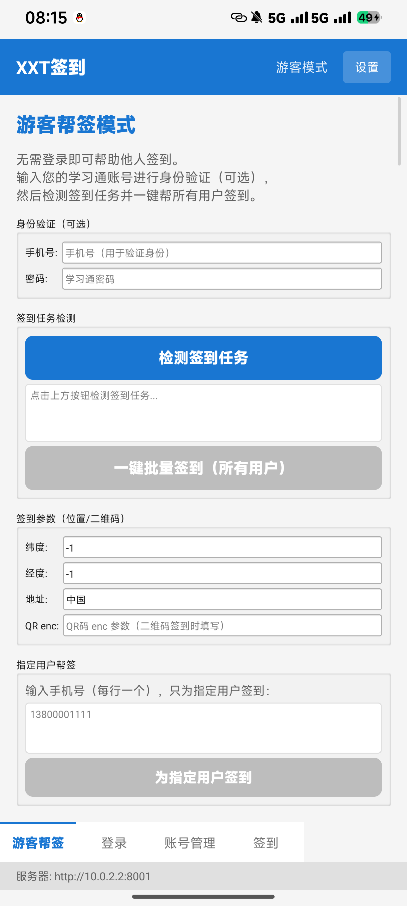

<p align="center">
  
</p>

<h1 align="center">梦寻签到</h1>

<p align="center">
  学习通（超星）批量签到助手 · Android + 云服务器
</p>

<p align="center">
  
  
  
  
</p>

---

## 功能

<table>
  <tr>
    <td width="50%">
      <h3>📋 自动检测</h3>
      <p>每 30 秒轮询学习通 API，检测到新签到任务时推送系统通知</p>
    </td>
    <td width="50%">
      <h3>🚀 一键签到</h3>
      <p>支持全部签到类型：普通 / 二维码 / 位置 / 拍照 / 手势</p>
    </td>
  </tr>
  <tr>
    <td>
      <h3>👥 批量签到</h3>
      <p>从云服务器拉取所有已存账号，逐个登录签到，一次完成</p>
    </td>
    <td>
      <h3>📷 二维码扫描</h3>
      <p>实时摄像头预览 + 扫描框叠加，自动拍照 → 服务端 OpenCV 解码</p>
    </td>
  </tr>
  <tr>
    <td>
      <h3>🤝 朋友帮签</h3>
      <p>生成分享链接，朋友在浏览器中扫码 / 定位 / 拍照后自动完成签到。前台服务后台保活，实时登录获取新鲜 Cookie</p>
    </td>
    <td>
      <h3>🔐 安全存储</h3>
      <p>客户端 AES 加密 + 设备 UUID 隔离，每台设备只能访问自己的账号</p>
    </td>
  </tr>
  <tr>
    <td>
      <h3>🔄 自动更新</h3>
      <p>启动检查新版本 → 内嵌进度条流式下载（避免 27MB OOM）→ 自动调起系统安装器</p>
    </td>
    <td>
      <h3>📍 GPS 定位</h3>
      <p>自动请求位置权限，10 秒超时回退，支持位置签到</p>
    </td>
  </tr>
</table>

## 架构

```
┌── 手机端 (Qt 6 Android C++) ──────────────────────┐
│                                                     │
│  ChaoxingClient ──HTTPS 直连──→ 学习通 API          │
│  ApiClient ────HTTPS──→ 云服务器                    │
│  ShareHelper (Java) 前台服务后台帮签                 │
│                                                     │
└─────────────────────────────────────────────────────┘
                         │
                         ▼
┌── 云服务器 (FastAPI + SQLite) ──────────────────────┐
│                                                     │
│  /api/accounts/*   加密账号存储 (按 device_id 隔离)  │
│  /api/sign/*       QR 解码 · 签到日志               │
│  /api/share/*      帮签创建 · 轮询 · 上报            │
│  /api/update/*     版本检查 · APK 下载               │
│                                                     │
└─────────────────────────────────────────────────────┘
```

> **关键设计**：学习通 API 从手机直连（服务器 IP 被 CDN 封锁），服务器仅做加密存储、QR 解码、帮签协调。

## 快速开始

### 环境

- Qt 6.11+ · Android NDK 27+ · JDK 17+
- Python 3.10+ · FastAPI · OpenCV

### 客户端

```bash
git clone https://github.com/Mengxun326/mengxun-sign.git
cd mengxun-sign/client

# 编译
mkdir build-qmake && cd build-qmake
qmake -qtconf /path/to/qt/android_arm64_v8a/bin/target_qt.conf ../XXTSign.pro
make -j$(nproc)

# 打包 & 安装
cp libXXTSign_arm64-v8a.so ../build-android-qmake/android-build/libs/arm64-v8a/
cd ../build-android-qmake/android-build && ./gradlew assembleRelease
adb install -r build/outputs/apk/release/android-build-release-unsigned.apk
```

### 服务端

```bash
cd server
pip install -r requirements.txt
uvicorn main:app --host 0.0.0.0 --port 8001
```

## 项目结构

```
├── client/                         # Qt Android App
│   ├── XXTSign.pro                 # qmake 项目文件
│   ├── main.cpp                    # 入口 + JNI 注册
│   ├── mainwindow.h/cpp            # 主窗口 · 导航 · 更新
│   ├── network/
│   │   ├── apiclient.h/cpp         # → 云服务器
│   │   └── chaoxingclient.h/cpp    # → 学习通直连
│   ├── crypto/
│   │   └── cryptohelper.h/cpp      # AES 加解密
│   ├── ui/
│   │   ├── signintab.h/cpp         # 签到 · 扫码 · 帮签
│   │   └── accounttab.h/cpp        # 账号管理
│   └── android/
│       ├── AndroidManifest.xml
│       └── src/.../                # Java 后台服务
└── server/                         # FastAPI 云服务器
    ├── main.py                     # API 端点
    ├── models.py                   # 数据模型
    ├── database.py                 # 初始化 + 迁移
    ├── config.py                   # 配置
    └── update.json                 # 版本元数据
```

## API

| 方法 | 端点 | 说明 |
|------|------|------|
| `POST` | `/api/accounts/add` | 加密存储账号 |
| `GET` | `/api/accounts/list` | 按设备列出账号 |
| `DELETE` | `/api/accounts/{id}` | 删除账号 |
| `POST` | `/api/sign/decode-qr` | 二维码解码 |
| `POST` | `/api/sign/log` | 签到日志 |
| `POST` | `/api/share/create` | 创建帮签链接 |
| `GET` | `/api/share/page/{token}` | 帮签页面 |
| `POST` | `/api/share/submit/{token}` | 提交帮签数据 |
| `GET` | `/api/share/pending/{token}` | 轮询待处理 |
| `GET` | `/api/update/check` | 版本检查 |
| `GET` | `/api/update/download` | APK 下载 |

## License

MIT · 仅供学习交流使用
